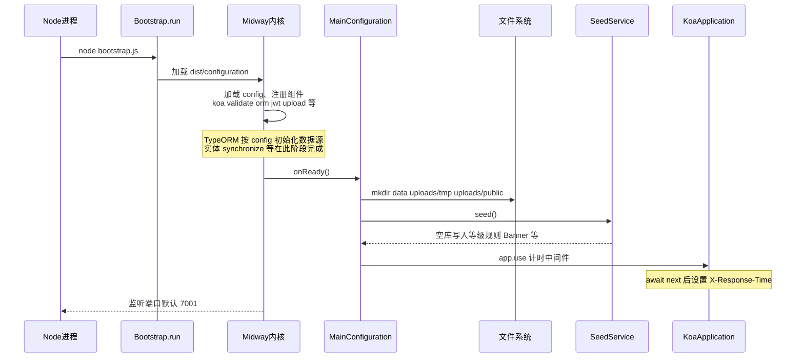
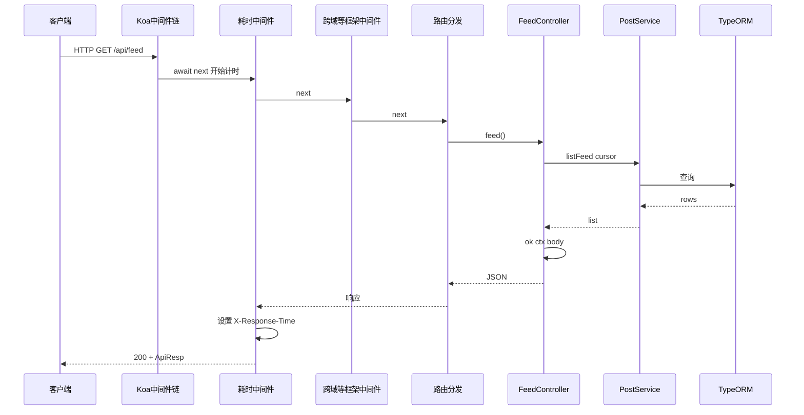
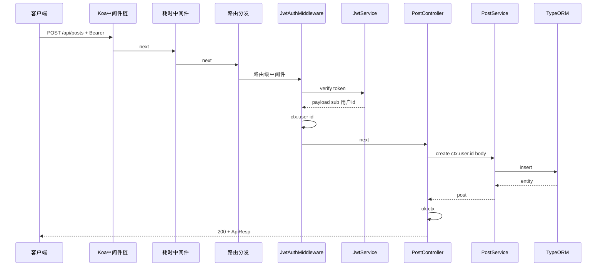

# apps/api 执行时序说明

本文描述 **进程启动** 与 **单次 HTTP 请求** 在 Midway + Koa 下的典型执行顺序，便于对照源码（入口见 [bootstrap.js](bootstrap.js)，装配见 [src/configuration.ts](src/configuration.ts)）。

---

## 1. 进程启动（冷启动）

Midway 会在内部依次完成**配置加载、依赖注入容器构建、各 `import` 组件初始化**（含 TypeORM 连接 sqljs、JWT 模块注册等），然后调用配置类的生命周期钩子。下图突出与业务最相关的节点。



### 启动阶段要点

| 阶段       | 位置                    | 行为                                                              |
| ---------- | ----------------------- | ----------------------------------------------------------------- |
| 入口       | `bootstrap.js`          | `Bootstrap.run({ module: require('./dist/configuration') })`      |
| 装配       | `src/configuration.ts`  | `@Configuration.imports` 引入 Koa、TypeORM、JWT、上传、静态文件等 |
| 数据目录   | `onReady`               | 确保 `data/`、`uploads/tmp`、`uploads/public` 存在                |
| 种子数据   | `SeedService.seed()`    | 表为空时插入等级、积分规则、Banner、示例商品等                    |
| 全局中间件 | `onReady`               | 仅挂载**请求耗时**中间件；**未**全局挂载 JWT                      |
| 鉴权       | 各 `@Controller` / 路由 | `JwtAuthMiddleware` / `JwtOptionalMiddleware` **按路由**声明      |

---

## 2. HTTP 请求（以两类接口为例）

### 2.1 公开读接口（无 JWT）

例如 `GET /api/feed`：不挂载 JWT 中间件，直接进入 Controller。



### 2.2 需登录写接口（JWT 强制）

例如 `POST /api/posts`（带 `Authorization: Bearer`）：先进入 `JwtAuthMiddleware`，校验通过后写入 `ctx.user`，再进 Controller。



### 2.3 可选 JWT（访客 + 登录态分支）

例如 `GET /api/users/:id` 使用 `JwtOptionalMiddleware`：无 Bearer 或 token 无效时**不拦截**，仅在有合法 token 时设置 `ctx.user`；Controller 内用 `ctx.user?.id` 区分访客与本人。

```mermaid
sequenceDiagram
  participant Client as 客户端
  participant Rtr as 路由
  participant Opt as JwtOptionalMiddleware
  participant UserCtrl as UserController
  participant UserSvc as UserService

  Client->>Rtr: GET /api/users/1 可选带 Bearer
  Rtr->>Opt: next
  alt 无 Bearer 或校验失败
    Opt->>UserCtrl: next ctx.user 未设置
  else 合法 Bearer
    Opt->>Opt: ctx.user id
    Opt->>UserCtrl: next
  end
  UserCtrl->>UserSvc: getPublicProfile id viewerId
  UserSvc-->>UserCtrl: profile
  UserCtrl->>UserCtrl: ok ctx
```

---

## 3. 与目录的对应关系

| 时序环节             | 主要代码位置                                                          |
| -------------------- | --------------------------------------------------------------------- |
| 进程入口             | `bootstrap.js`                                                        |
| 组件装配与 `onReady` | `src/configuration.ts`                                                |
| HTTP 统一成功/失败体 | `src/util/response.ts`                                                |
| 鉴权中间件           | `src/middleware/jwt-auth.middleware.ts`、`jwt-optional.middleware.ts` |
| 登录限流             | `src/middleware/login-rate-limit.middleware.ts`（按需挂在路由上）     |
| 路由与业务           | `src/controller/*.ts` → `src/service/*.ts` → `src/entity/*.ts`        |
| 运行时配置           | `src/config/config.default.ts`                                        |

---

## 4. 说明

- 图中 **Midway 内核**对 Koa 的 body 解析、校验、跨域等细节未逐层展开，以「Koa 中间件链」概括；实际顺序以 Midway 版本与 `imports` 顺序为准。
- **静态文件** `/uploads` 若由静态组件命中，可能不经过业务 Controller，图中未单独画出。
- 若需把本图同步进仓库 Wiki，可直接引用本文件路径：`apps/api/RUNTIME_SEQUENCE.md`。
